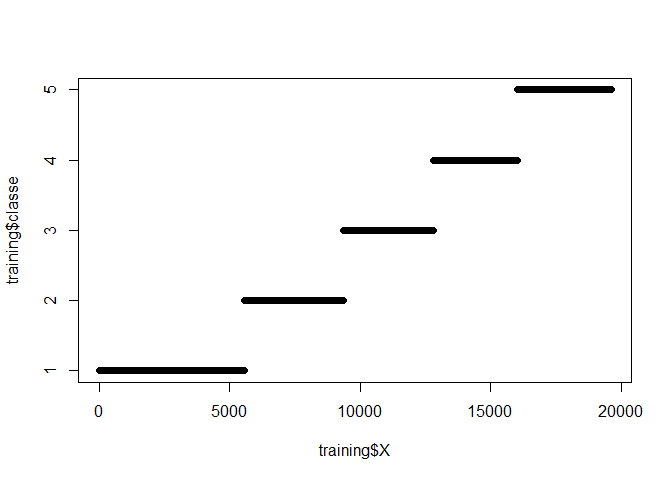

# Practical_Meachine_Learning_Proj
Hanna Zhao  
October 7, 2016  


## Background

This is the course project of Cousera Practical Machine Learning class. Personal wearable such as Jawbone Up, Nike FuelBand, and Fitbit generates a large amount of personal activity data. The goal of this study is to use these data to quantify how well the subject performs certain activity. 

The data for this project come from this source:[linked phrase] (http://groupware.les.inf.puc-rio.br/har). Six participants were asked to performa barbell lifts correctly and incorrectly in 5 different ways. This was categoried in the "classe" variable in the training data set. The goal is to predict the manner in 20 cases in the testing data set. 

# Load and Preprocess data
The training set and testing set can be downloaded from the following link. There are a lot of missing data points in the original data set. Some of them are marked as "NA" and others are just empty. Therefore, "na.string = c("", "NA"")" is used when loading the data. 


```r
library(caret)
```

```
## Loading required package: lattice
```

```
## Loading required package: ggplot2
```

```r
#fileUrl <- "https://d396qusza40orc.cloudfront.net/predmachlearn/pml-training.csv"
fileDes <- "C:/Users/zhao_h/Documents/R_WD/pml-training.csv"

#download.file(fileUrl, fileDes)
training <- read.csv(fileDes, na.strings = c("","NA"))

#fileUrl <- "https://d396qusza40orc.cloudfront.net/predmachlearn/pml-testing.csv"
fileDes <- "C:/Users/zhao_h/Documents/R_WD//pml-testing.csv"

#download.file(fileUrl, fileDes)
testing <- read.csv(fileDes, na.strings = c("","NA"))
```

In the data cleaning step, I first removed irrelavant columns with more than 90% missing values.  columns. 


```r
col_mark <- colSums(is.na(training))/dim(training)[1]<0.90
Pre_training <- training[,col_mark]
testing <- testing[, col_mark]
```

Another tricky part is the first column, which is basically row number. Since the training set is sorted by the classe column. See the plot below. There is an artificial correlation between classe and row number, which would confuse the machine learning algorithm. Therefore, it is also removed. 

```r
plot(training$X, training$classe)
```

<!-- -->

```r
Pre_training <- Pre_training[,-1]
testing <- testing[, -1]
```

##Data partition
Divide training set to two portions for model training and cross validation.

```r
set.seed(333)
indTrain <- createDataPartition(y = Pre_training$classe, p=0.6, list = FALSE)
Part_training <-Pre_training[indTrain,]
Part_testing <-Pre_training[-indTrain,]
```

##Model training
Three models were selected to test: decision tree, boosting and random forest. 


```r
t1 <- system.time(mod1<- train(classe ~ ., method = "rpart", data = Part_training))

t2<- system.time(mod2<- train(classe ~ ., method = "gbm", data = Part_training))

t3<- system.time(mod3<- train(classe ~ ., method = "rf", data = Part_training, prox=TRUE, ntree=20))
```

The comparison is summarized in this table. The first model is the fastest, but accuracy is only 0.46. The second and third model has similar accurancy. Thrid model saves about half of the time.


```r
A1 <- confusionMatrix(Part_testing$classe, predict(mod1,Part_testing))[3]$overall[1]
A2 <- confusionMatrix(Part_testing$classe, predict(mod2,Part_testing))[3]$overall[1]
A3 <- confusionMatrix(Part_testing$classe, predict(mod3,Part_testing))[3]$overall[1]

summary_table <- data.frame("model"=c("1. decision tree", "2. boosting","3. random forest"),"time"= c(t1[1],t2[1],t3[1]), "accurancy" = c(A1, A2, A3), "Out-of-Sample Error (%)" = c((1-A1)*100,(1-A2)*100,(1-A3)*100))
 
kable(head(summary_table), format = "markdown")
```


|model            |    time| accurancy| Out.of.Sample.Error....|
|:----------------|-------:|---------:|-----------------------:|
|1. decision tree |   17.72| 0.4639307|              53.6069335|
|2. boosting      | 1877.71| 0.9955391|               0.4460872|
|3. random forest |  890.70| 0.9985980|               0.1401988|


```r
confusionMatrix(Part_testing$classe, predict(mod1,Part_testing))
```

```
## Confusion Matrix and Statistics
## 
##           Reference
## Prediction    A    B    C    D    E
##          A 1825    0  402    0    5
##          B  782    0  736    0    0
##          C  210    0 1158    0    0
##          D  454    0  832    0    0
##          E  103    0  682    0  657
## 
## Overall Statistics
##                                          
##                Accuracy : 0.4639         
##                  95% CI : (0.4528, 0.475)
##     No Information Rate : 0.4856         
##     P-Value [Acc > NIR] : 0.9999         
##                                          
##                   Kappa : 0.3105         
##  Mcnemar's Test P-Value : NA             
## 
## Statistics by Class:
## 
##                      Class: A Class: B Class: C Class: D Class: E
## Sensitivity            0.5409       NA   0.3039       NA  0.99245
## Specificity            0.9090   0.8065   0.9480   0.8361  0.89073
## Pos Pred Value         0.8177       NA   0.8465       NA  0.45562
## Neg Pred Value         0.7241       NA   0.5906       NA  0.99922
## Prevalence             0.4300   0.0000   0.4856   0.0000  0.08437
## Detection Rate         0.2326   0.0000   0.1476   0.0000  0.08374
## Detection Prevalence   0.2845   0.1935   0.1744   0.1639  0.18379
## Balanced Accuracy      0.7249       NA   0.6260       NA  0.94159
```

```r
confusionMatrix(Part_testing$classe, predict(mod2,Part_testing))
```

```
## Confusion Matrix and Statistics
## 
##           Reference
## Prediction    A    B    C    D    E
##          A 2232    0    0    0    0
##          B    2 1510    2    4    0
##          C    0    1 1355   12    0
##          D    0    0    5 1278    3
##          E    0    0    0    6 1436
## 
## Overall Statistics
##                                           
##                Accuracy : 0.9955          
##                  95% CI : (0.9938, 0.9969)
##     No Information Rate : 0.2847          
##     P-Value [Acc > NIR] : < 2.2e-16       
##                                           
##                   Kappa : 0.9944          
##  Mcnemar's Test P-Value : NA              
## 
## Statistics by Class:
## 
##                      Class: A Class: B Class: C Class: D Class: E
## Sensitivity            0.9991   0.9993   0.9949   0.9831   0.9979
## Specificity            1.0000   0.9987   0.9980   0.9988   0.9991
## Pos Pred Value         1.0000   0.9947   0.9905   0.9938   0.9958
## Neg Pred Value         0.9996   0.9998   0.9989   0.9966   0.9995
## Prevalence             0.2847   0.1926   0.1736   0.1657   0.1834
## Detection Rate         0.2845   0.1925   0.1727   0.1629   0.1830
## Detection Prevalence   0.2845   0.1935   0.1744   0.1639   0.1838
## Balanced Accuracy      0.9996   0.9990   0.9964   0.9909   0.9985
```

```r
confusionMatrix(Part_testing$classe, predict(mod3,Part_testing))
```

```
## Confusion Matrix and Statistics
## 
##           Reference
## Prediction    A    B    C    D    E
##          A 2231    1    0    0    0
##          B    2 1515    1    0    0
##          C    0    1 1366    1    0
##          D    0    0    3 1283    0
##          E    0    0    0    2 1440
## 
## Overall Statistics
##                                           
##                Accuracy : 0.9986          
##                  95% CI : (0.9975, 0.9993)
##     No Information Rate : 0.2846          
##     P-Value [Acc > NIR] : < 2.2e-16       
##                                           
##                   Kappa : 0.9982          
##  Mcnemar's Test P-Value : NA              
## 
## Statistics by Class:
## 
##                      Class: A Class: B Class: C Class: D Class: E
## Sensitivity            0.9991   0.9987   0.9971   0.9977   1.0000
## Specificity            0.9998   0.9995   0.9997   0.9995   0.9997
## Pos Pred Value         0.9996   0.9980   0.9985   0.9977   0.9986
## Neg Pred Value         0.9996   0.9997   0.9994   0.9995   1.0000
## Prevalence             0.2846   0.1933   0.1746   0.1639   0.1835
## Detection Rate         0.2843   0.1931   0.1741   0.1635   0.1835
## Detection Prevalence   0.2845   0.1935   0.1744   0.1639   0.1838
## Balanced Accuracy      0.9995   0.9991   0.9984   0.9986   0.9998
```

Please note in the third model of random forest, the tree number is set to be limited at 20 in order to save training time. Without this limiation, the default setting takes more than 3.5 hours for model training. Accuracy is 0.999. The evaluation is disabled in knit here to save time.


```r
t4<- system.time(mod4<- train(classe ~ ., method = "rf", data = Part_training, prox=TRUE))
confusionMatrix(Part_testing$classe, predict(mod4,Part_testing))
```


##Result
To balance performance and speed,  model 3 "random forest" with limited tree number (20) is selected as the best model. Out of sample error is 0.14%. 

Finally, let's predict the activity manner in the testing data set. The results from model 2 and model 3 agree with each other very well. it confirmed the previous accuracy number.


```r
predict(mod2, testing)
```

```
##  [1] B A B A A E D B A A B C B A E E A B B B
## Levels: A B C D E
```

```r
predict(mod3, testing)
```

```
##  [1] B A B A A E D B A A B C B A E E A B B B
## Levels: A B C D E
```
